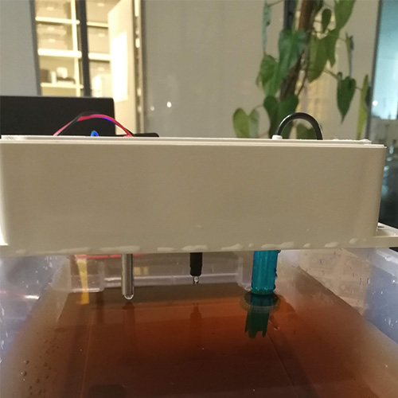

# Münsterhack 2019 (v1)

Zur besseren überwachung von Gewässern haben wir uns damit beschäftigt wie man möglichst günstig brauchbare Wassermesswerte erfassen kann. Im Rahmen des [Münsterhacks 2019](http://www.muensterhack.de/) haben wir einen Prototypen gebaut. Wir nutzen LoraWAN um die Daten von der Messstation in eine Datenbank zu übertragen.

### Teileliste
Controllerboard: LoRa Mini 868 MHz        

| Messwert             | Sensor        |
| -------------------- |:-------------:|
| Trübheit des Wassers | SEN0189       |
| PH-Wert              | SEN0161(Test); SEN0169 (später für Prod – 1 Jahr Daueraußenbetrieb möglich) |
| Leitwertsensor       | SEN0244       |
| Wassertemperatur     | DS18b20       |

### Dashboard

Das dashboard ist [hier](https://mshack.lorawan.digital/team5/ui/) verfügbar.

### Prototyp (v1)

Weitere Projekte vom Münsterhack gibt es hier: https://github.com/codeformuenster/muensterhack

# Nach dem Münsterhack 2019

Nach dem Münsterhack haben wir uns noch weiter mit der Konstruktion einer Messonde beschäftigt. Im Rahmen einer Projektwoche an der Uni Osnabrück, wurde ein weiterer Prototyp (v2) entwicklet. Dieser umfasst zusätzlich einen Sensor zur Messung der Wassertrübung sowie eine allgemein verbessertes Gehäuse. 

### Prototyp (v2)

